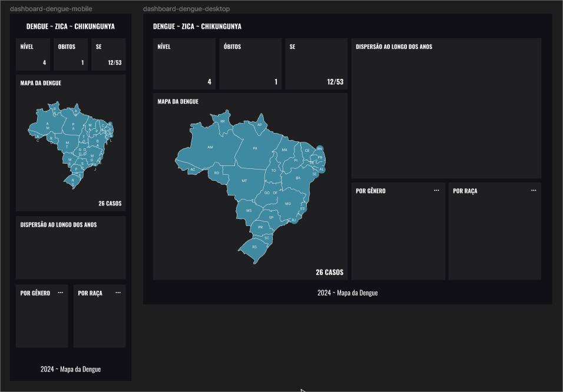

# Dengue APP

O Mapa da Dengue é um aplicativo projetado para fornecer informações atualizadas e detalhadas sobre as principais arboviroses que afetam o Brasil. Com dados em tempo real e análises abrangentes, este aplicativo visa promover a conscientização sobre a importância da prevenção e do controle dessas doenças, contribuindo significativamente para a saúde pública do país.
Arboviroses

- DENGUE
- ZICA
- CHIKUNGUNYA

